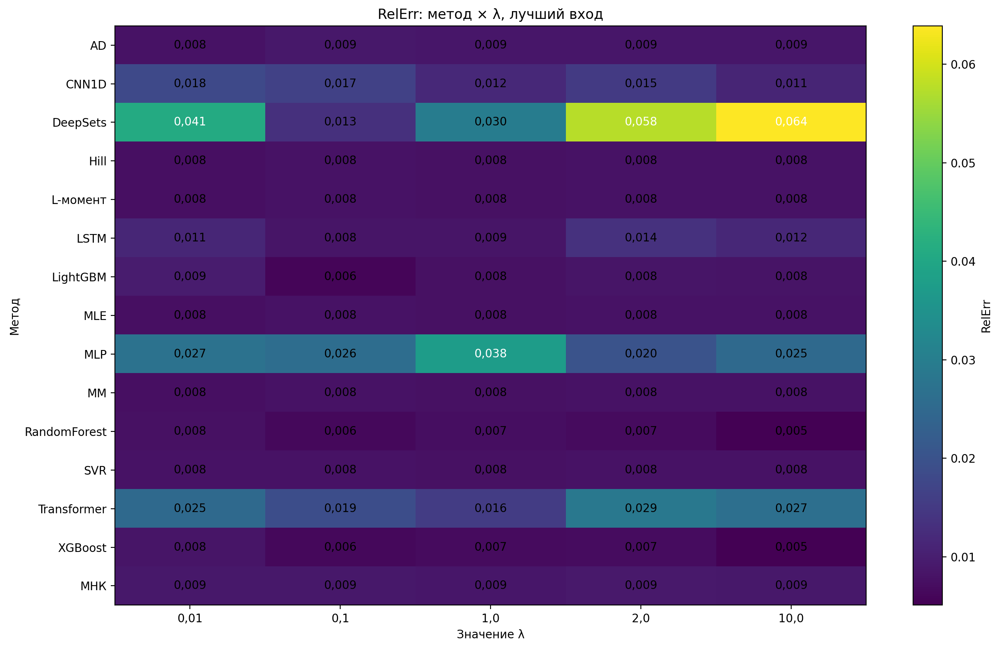
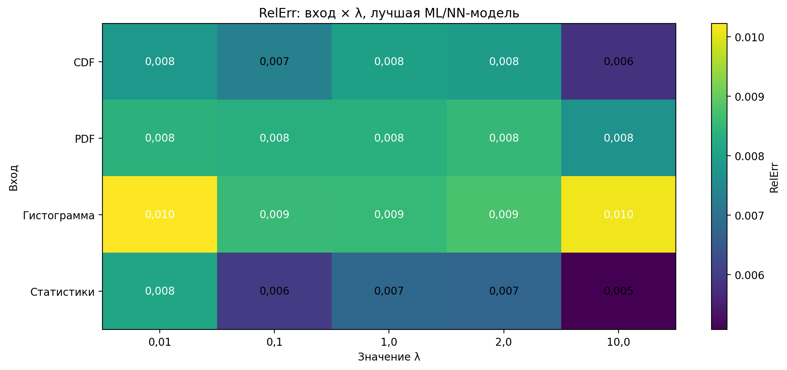
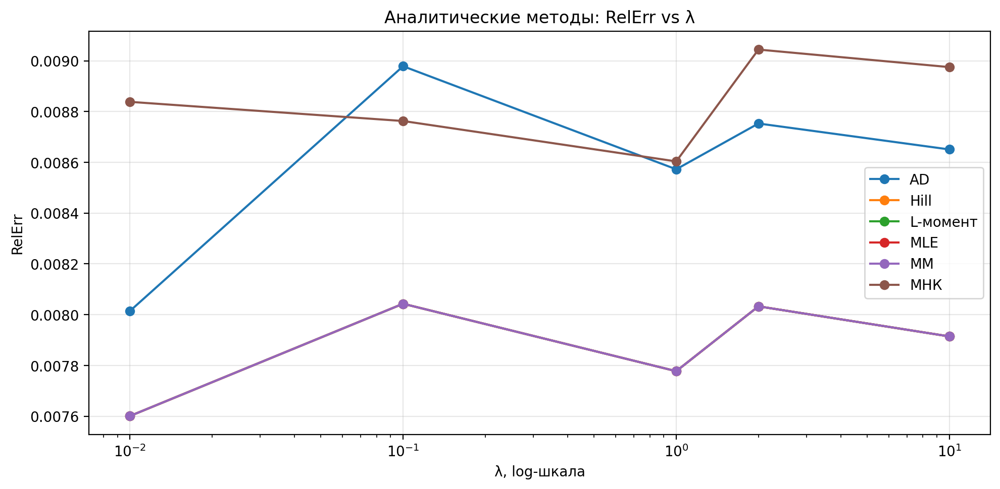
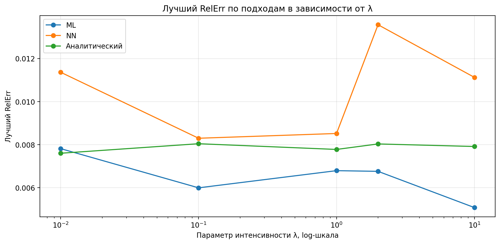
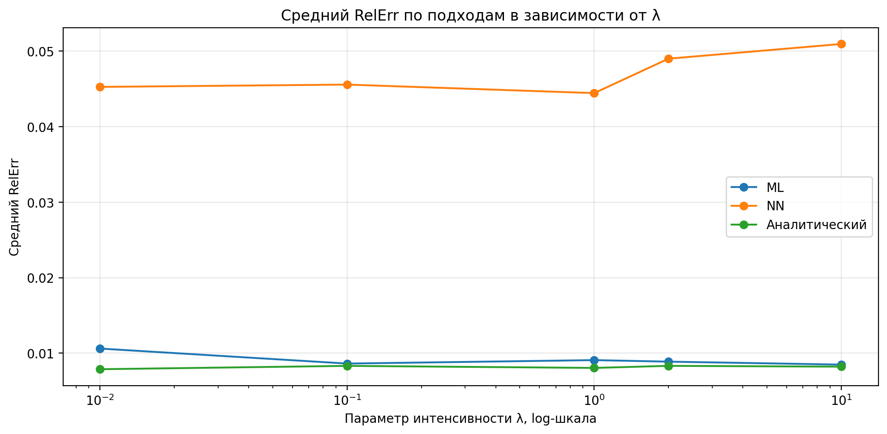
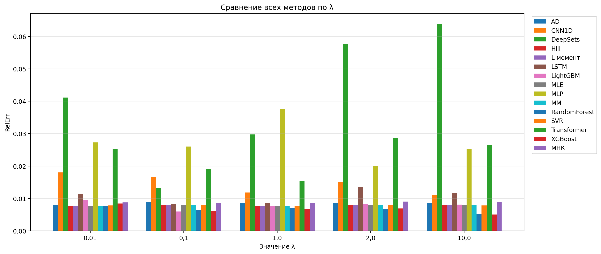

# Анализ результатов оценки параметра λ для экспоненциального распределения

## 1. Постановка нового анализа

В новом эксперименте модели машинного обучения и нейронные сети обучались не на исходном значении параметра `λ`, а на `log(λ)`. После предсказания выполнялось обратное преобразование:

```text
λ_pred = exp(y_pred)
```

Это уменьшает влияние масштаба параметра и делает обучение устойчивее на широком диапазоне значений `λ`.

В анализе используются следующие значения параметра:

```text
λ = 0,01; 0,1; 1; 2; 10
```

Рассматриваются три группы методов:

- аналитические методы;
- ML-модели;
- NN-модели.

## 2. Основной результат

Главный результат нового эксперимента: после перехода к `log(λ)` и отказа от сырых моментов/интервалов качество ML- и NN-моделей существенно улучшилось. Особенно заметное улучшение наблюдается при `λ = 0,01`, где в предыдущем анализе ML и NN давали большие ошибки.

### Лучший RelErr по подходам

| λ      | Аналитический best   | ML best   | NN best   |
|:-------|:---------------------|:----------|:----------|
| 0,01  | 0,008                | 0,008     | 0,011     |
| 0,1  | 0,008                | 0,006     | 0,008     |
| 1 | 0,008                | 0,007     | 0,009     |
| 2  | 0,008                | 0,007     | 0,014     |
| 10 | 0,008                | 0,005     | 0,011     |

### Лучший метод для каждого λ и подхода

| λ      | Подход        | Лучший метод   | Вход        | RelErr   |
|:-------|:--------------|:---------------|:------------|:---------|
| 0,01  | ML            | RandomForest   | CDF         | 0,008    |
| 0,01  | NN            | LSTM           | Гистограмма | 0,011    |
| 0,01  | Аналитический | MM             | Интервалы   | 0,008    |
| 0,1  | ML            | LightGBM       | Статистики  | 0,006    |
| 0,1  | NN            | LSTM           | PDF         | 0,008    |
| 0,1  | Аналитический | L-момент       | Интервалы   | 0,008    |
| 1  | ML            | XGBoost        | Статистики  | 0,007    |
| 1  | NN            | LSTM           | Гистограмма | 0,009    |
| 1  | Аналитический | MLE            | Интервалы   | 0,008    |
| 2 | ML            | RandomForest   | Статистики  | 0,007    |
| 2  | NN            | LSTM           | Статистики  | 0,014    |
| 2  | Аналитический | MLE            | Интервалы   | 0,008    |
| 10 | ML            | XGBoost        | Статистики  | 0,005    |
| 10 | NN            | CNN1D          | Статистики  | 0,011    |
| 10 | Аналитический | MLE            | Интервалы   | 0,008    |

### Абсолютно лучший метод для каждого λ

| λ      | Лучший подход   | Метод        | Вход       | RelErr   |
|:-------|:----------------|:-------------|:-----------|:---------|
| 0,01  | Аналитический   | MM           | Интервалы  | 0,008    |
| 0,1  | ML              | LightGBM     | Статистики | 0,006    |
| 1  | ML              | XGBoost      | Статистики | 0,007    |
| 2  | ML              | RandomForest | Статистики | 0,007    |
| 10| ML              | XGBoost      | Статистики | 0,005    |

Из таблиц видно, что ML-модели стали лучшими для большинства значений `λ`. Аналитические методы остаются очень стабильными, но в новом эксперименте ML в ряде случаев даёт меньший RelErr на тестовой выборке.

## 3. Тепловая карта: метод × λ



На тепловой карте видно, что аналитические методы `MM`, `MLE`, `L-момент` и `Hill` дают почти одинаковые значения RelErr около `0,008`. Это ожидаемо для экспоненциального распределения, так как параметр интенсивности оценивается через средний интервал.

Среди ML-моделей лучше всего проявили себя:

- `RandomForest`;
- `XGBoost`;
- `LightGBM`;
- `SVR`.

Среди NN-моделей наиболее устойчивой оказалась `LSTM`. Модель `DeepSets` в текущей постановке показывает самые нестабильные результаты.

## 4. Влияние входных признаков



### Сводка по входам

| Вход        | Средний RelErr   | Минимальный RelErr   | Максимальный RelErr   |
|:------------|:-----------------|:---------------------|:----------------------|
| Статистики  | 0,025            | 0,005                | 0,139                 |
| CDF         | 0,027            | 0,006                | 0,167                 |
| PDF         | 0,030            | 0,008                | 0,107                 |
| Гистограмма | 0,039            | 0,009                | 0,112                 |

Лучший вход в новом анализе — `Статистики`.

Это логично для экспоненциального распределения, потому что параметр `λ` напрямую связан со средним интервалом:

```text
λ_hat = 1 / mean(τ)
```

Если среди статистических признаков есть `mean(τ)`, `std(τ)`, `median(τ)`, `lambda_mm = 1 / mean(τ)` и `log(lambda_mm)`, то модель получает почти всю необходимую информацию для оценки параметра.

### Вывод по входам

- `Статистики` — лучший и наиболее интерпретируемый вход.
- `CDF` — хороший устойчивый альтернативный вход.
- `PDF` — стабильный, но в новом анализе уступает статистикам.
- `Гистограмма` — худший из четырёх входов, но уже без катастрофических провалов.

## 5. Аналитические методы



Аналитические методы работают стабильно по всему диапазону `λ`.

Методы `MM`, `MLE`, `L-момент` и `Hill` практически совпадают. Это связано с тем, что для экспоненциального распределения оценка параметра строится через выборочное среднее интервалов.

Сейчас RelErr метода `AD` находится примерно на уровне `0,008–0,009`.

Метод `МНК` немного хуже основных аналитических методов, но остаётся устойчивым.

## 6. Сравнение подходов





По лучшему результату ML стал сильнейшим подходом для большинства значений `λ`.

По среднему качеству аналитические методы остаются более стабильными, потому что внутри ML и NN есть модели с худшими результатами. Особенно это заметно для NN-группы, где `DeepSets`, `MLP` и частично `Transformer` ухудшают средний показатель.

### Сводка по методам

| Подход        | Метод        | Средний RelErr   | Минимальный RelErr   | Максимальный RelErr   |
|:--------------|:-------------|:-----------------|:---------------------|:----------------------|
| ML            | SVR          | 0,009            | 0,008                | 0,013                 |
| ML            | RandomForest | 0,009            | 0,005                | 0,015                 |
| ML            | XGBoost      | 0,009            | 0,005                | 0,015                 |
| ML            | LightGBM     | 0,010            | 0,006                | 0,013                 |
| NN            | LSTM         | 0,016            | 0,008                | 0,028                 |
| NN            | Transformer  | 0,038            | 0,016                | 0,086                 |
| NN            | CNN1D        | 0,044            | 0,011                | 0,112                 |
| NN            | MLP          | 0,054            | 0,020                | 0,092                 |
| NN            | DeepSets     | 0,083            | 0,013                | 0,167                 |
| Аналитический | Hill         | 0,008            | 0,008                | 0,008                 |
| Аналитический | L-момент     | 0,008            | 0,008                | 0,008                 |
| Аналитический | MLE          | 0,008            | 0,008                | 0,008                 |
| Аналитический | MM           | 0,008            | 0,008                | 0,008                 |
| Аналитический | AD           | 0,009            | 0,008                | 0,009                 |
| Аналитический | МНК          | 0,009            | 0,009                | 0,009                 |

## 7. Сравнение всех методов по λ



График показывает, что:

- аналитические методы образуют устойчивую нижнюю группу ошибок;
- лучшие ML-модели находятся на том же уровне или ниже;
- NN-модели стали значительно лучше, чем раньше, но в среднем всё ещё уступают ML.

## 8. Сравнение с предыдущим анализом

В предыдущем анализе ML и NN сильно ошибались при малых значениях `λ`, особенно при `λ = 0,01`.

### Сравнение старых и новых лучших результатов

| λ      | Старый ML best   | Новый ML best   | Улучшение ML, раз   | Старый NN best   | Новый NN best   | Улучшение NN, раз   |
|:-------|:-----------------|:----------------|:--------------------|:-----------------|:----------------|:--------------------|
| 0,01  | 2,002            | 0,008           | 256,233             | 4,441            | 0,011           | 390,871             |
| 0,1 | 0,035            | 0,006           | 5,855               | 0,075            | 0,008           | 9,099               |
| 1| 0,007            | 0,007           | 1,090               | 0,014            | 0,009           | 1,632               |
| 2  | 0,008            | 0,007           | 1,198               | 0,010            | 0,014           | 0,752               |
| 10 | 0,009            | 0,005           | 1,674               | 0,009            | 0,011           | 0,800               |

### Что изменилось

Раньше:

- ML и NN резко ухудшались при `λ = 0,01`;
- NN-модели давали большие ошибки на нижней экстраполяции;
- лучшим входом часто выглядел `PDF`;
- статистики были нестабильны из-за отдельных неудачных моделей;
- аналитика была явно лучшей и самой устойчивой.

Сейчас:

- ML почти везде достигает уровня аналитики или лучше;
- NN стали намного устойчивее;
- `Статистики` стали лучшим входом;
- `CDF` стал хорошим альтернативным входом;
- `PDF` перестал быть главным входом;
- `AD` исправлен и больше не портит аналитическую группу;
- проблема `λ = 0,010` практически решена.

## 9. Научная интерпретация результата

Новый результат не означает, что ML теоретически превзошёл аналитическую оценку. Для экспоненциального распределения аналитическая оценка через средний интервал является естественным теоретическим ориентиром.

Корректная формулировка:

> ML-модели приблизились к аналитическому уровню качества и в отдельных тестовых случаях показали меньший RelErr, что связано с особенностями обучающей выборки, логарифмированием целевого параметра и использованием информативных статистических признаков.

То есть ML не заменяет теоретическую оценку для `Exp(λ)`, а показывает способность воспроизводить её по данным и сохранять устойчивость на широком диапазоне параметров.

## 10. Итоговые выводы

1. Переход к обучению на `log(λ)` существенно повысил устойчивость ML- и NN-моделей.
2. Использование входов `CDF`, `PDF`, `Статистики`, `Гистограмма` позволило отказаться от сырых моментов и интервалов, которые раньше давали нестабильные результаты.
3. Лучшим входом стали `Статистики`.
4. Лучшие ML-модели (`XGBoost`, `RandomForest`, `LightGBM`) достигли RelErr порядка `0,005–0,008`.
5. Аналитические методы сохраняют стабильное качество на уровне около `0,008`.
6. NN-модели заметно улучшились, но в среднем уступают ML.
7. Самой устойчивой NN-моделью стала `LSTM`.
8. `DeepSets` в текущей постановке не рекомендуется использовать как основную модель.
9. В итоговом сравнении нужно отдельно показывать лучший результат и средний результат, потому что они отвечают на разные вопросы.
