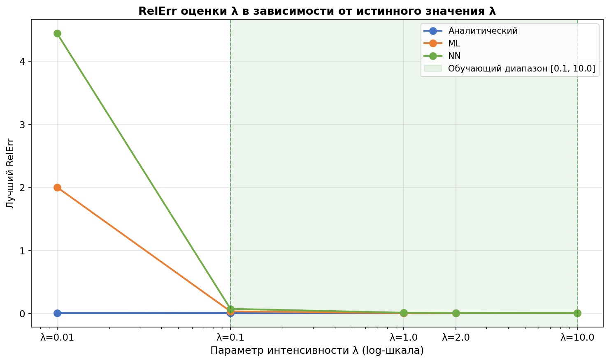
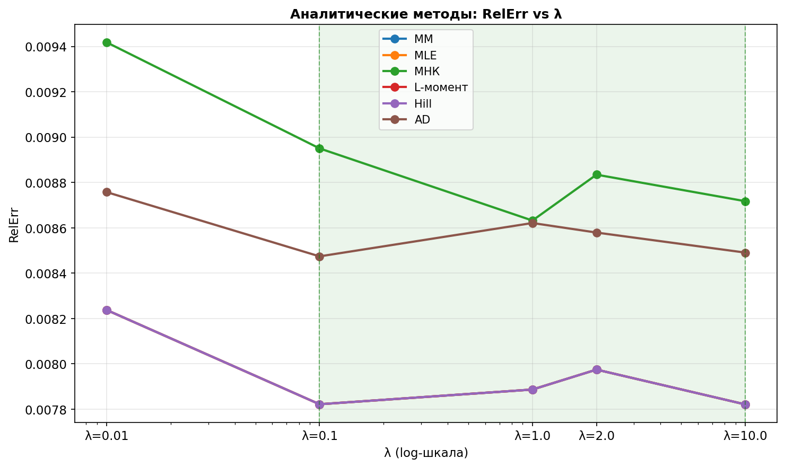
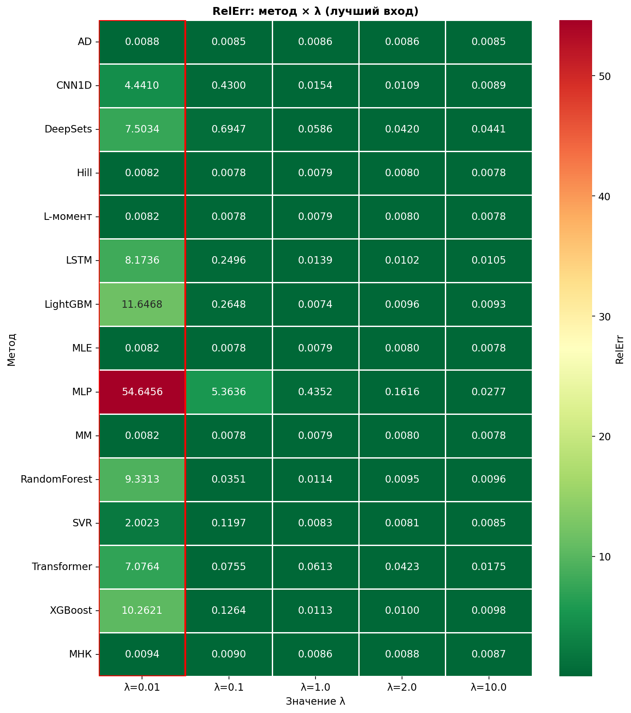
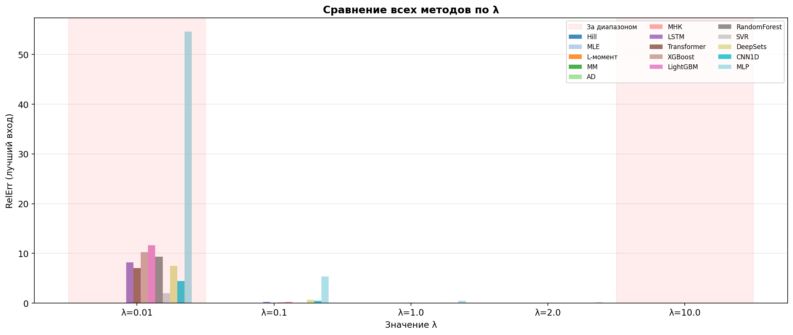
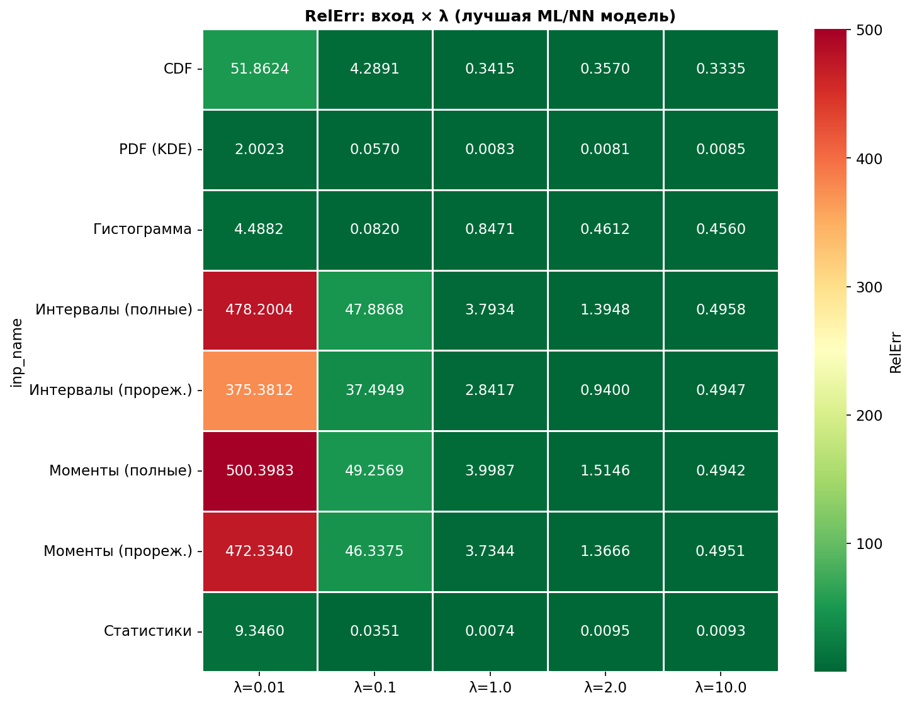
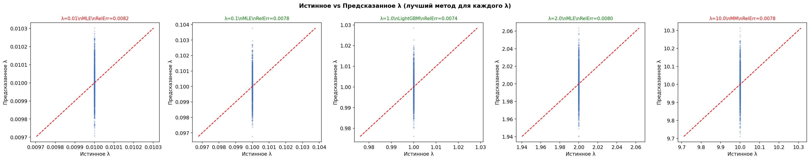

# Развернутый анализ результатов эксперимента для Exp(λ)

Генерация для обучения в диапазоне [0.1;10]

## 1. Цель эксперимента

В эксперименте сравнивались три группы методов оценки параметра интенсивности `λ` экспоненциального распределения:

1. аналитические методы;
2. классические ML-модели;
3. нейросетевые модели.

Проверялись значения:

| λ | Статус |
|---:|---|
| 0.01 | ниже обучающего диапазона |
| 0.1 | внутри обучающего диапазона |
| 1 | внутри обучающего диапазона |
| 2 | внутри обучающего диапазона |
| 10 | внутри обучающего диапазона |

---

## 2. Теоретическая основа

Для экспоненциального распределения интервалы между событиями имеют плотность:

$$
f(\tau; \lambda)=\lambda e^{-\lambda \tau}, \qquad \tau \ge 0, \lambda > 0.
$$

Функция распределения:

$$
F(\tau; \lambda)=1-e^{-\lambda \tau}.
$$

Оценка параметра методом максимального правдоподобия совпадает с оценкой методом моментов:

$$
\hat{\lambda}_{MLE}=\hat{\lambda}_{MM}=\frac{1}{\bar{\tau}}=\frac{n}{\sum_{i=1}^n \tau_i}.
$$

Относительная ошибка рассчитывается как:

$$
RelErr = \frac{|\hat{\lambda}-\lambda|}{\lambda}.
$$

Для критерия Андерсона–Дарлинга минимизируется статистика:

$$
A^2(\lambda)=-n-\frac{1}{n}\sum_{i=1}^n(2i-1)\left[\ln F(\tau_{(i)};\lambda)+\ln\left(1-F(\tau_{(n+1-i)};\lambda)\right)\right].
$$

---

## 3. Общая сводка по подходам

Таблица ниже показывает ошибку по всем строкам эксперимента, то есть с учетом всех моделей, входов и значений `λ`.


| Подход        |   Количество |      Среднее |   Медиана |   Минимум |      Максимум |
|:--------------|-------------:|-------------:|----------:|----------:|--------------:|
| ML            |          280 |    79.125  |  1.962  |  0.007 | 665.526       |
| NN            |          210 | 14823.100      |  1.526  |  0.009 |   3076000.000 |
| Аналитический |           30 |     0.008 |  0.008 |  0.008 |   0.009    |


### Интерпретация

1. **Аналитические методы дают лучший и самый устойчивый результат.**  
   Средний RelErr аналитических методов равен примерно `0.008`, медиана `0.008`.

2. **ML и NN имеют большие средние значения из-за выбросов.**  
   У ML среднее значение RelErr равно `79.125`, у NN — `14823.100`. Эти значения не отражают качество лучших моделей, потому что в расчет попадают неудачные входы и выбросы.

3. **Медиана у ML и NN значительно меньше среднего**, значит распределение ошибок сильно асимметрично: часть запусков работает хорошо, но отдельные комбинации модели и входа дают огромные ошибки.

---

## 4. Лучший RelErr по подходам и значениям λ


| Подход        |   λ=0.01 |    λ=0.1 |      λ=1 |      λ=2 |     λ=10 |
|:--------------|---------:|---------:|---------:|---------:|---------:|
| ML            | 2.002  | 0.035 | 0.007 | 0.008 | 0.009 |
| NN            | 4.441  | 0.076 | 0.014 | 0.010 | 0.009 |
| Аналитический | 0.008 | 0.008 | 0.008 | 0.008 | 0.008 |


### Вывод

Аналитические методы практически не зависят от значения `λ`: ошибка находится около `0.008`.

ML и NN ведут себя иначе:

- при `λ=1`, `λ=2`, `λ=10` лучшие ML/NN-модели почти достигают аналитического уровня;
- при `λ=0.1` ML и NN уже заметно хуже аналитики;
- при `λ=0.01` наблюдается сильное ухудшение, особенно у NN.

---


### График 1. RelErr по подходам в зависимости от λ



## 5. Аналитические методы


| Метод    |   Среднее |   Медиана |   Минимум |   Максимум |
|:---------|----------:|----------:|----------:|-----------:|
| Hill     |  0.008 |  0.008 |  0.008 |   0.008 |
| MLE      |  0.008 |  0.008 |  0.008 |   0.008 |
| L-момент |  0.008 |  0.008 |  0.008 |   0.008 |
| MM       |  0.008 |  0.008 |  0.008 |   0.008 |
| AD       |  0.009 |  0.009 |  0.008 |   0.009 |
| МНК      |  0.009  |  0.009 |  0.009 |   0.009 |


### Интерпретация

Лучшие аналитические методы:

- `MM`;
- `MLE`;
- `L-момент`;
- `Hill`.

Они дают практически одинаковую ошибку:

$$
RelErr \approx 0.008.
$$

Метод `МНК` работает немного хуже:

$$
RelErr \approx 0.009.
$$

Метод `AD` после исправления больше не является выбросом:

$$
RelErr_{AD} \approx 0.009.
$$

Но он все равно немного уступает `MM`, `MLE`, `L-моменту` и `Hill`.

Главный вывод: **для Exp(λ) аналитические методы являются эталоном качества**.

---


### График 2. Аналитические методы: RelErr vs λ



## 6. Лучший метод для каждого λ


|     λ | Лучший метод                                                                            |   RelErr |
|------:|:----------------------------------------------------------------------------------------|---------:|
|  0.010 | MM (Аналитический); MLE (Аналитический); L-момент (Аналитический); Hill (Аналитический) | 0.008 |
|  0.100  | MM (Аналитический); MLE (Аналитический); L-момент (Аналитический); Hill (Аналитический) | 0.008 |
|  1    | LightGBM (ML), вход: Статистики                                                         | 0.007 |
|  2    | MM (Аналитический); MLE (Аналитический); L-момент (Аналитический); Hill (Аналитический) | 0.008 |
| 10    | MM (Аналитический); MLE (Аналитический); L-момент (Аналитический); Hill (Аналитический) | 0.008 |


### Интерпретация

Для `λ=0.01`, `λ=0.1`, `λ=2`, `λ=10` лучший результат дают аналитические методы.

Для `λ=1` формально лучший результат у `LightGBM` на входе `Статистики`:

$$
RelErr = 0.007.
$$

Но это не означает, что ML теоретически лучше аналитики. Разница очень мала и может быть связана со случайной вариацией тестовой выборки. Для экспоненциального распределения аналитическая оценка через средний интервал остается естественным оптимальным ориентиром.

---

## 7. Сравнение методов по λ


| Метод        |    λ=0.010 |    λ=0.100 |      λ=1 |      λ=2 |     λ=10 |
|:-------------|----------:|---------:|---------:|---------:|---------:|
| AD           |  0.009 | 0.008 | 0.009 | 0.009 | 0.008 |
| MM           |  0.008 | 0.008 | 0.008 | 0.008 | 0.008 |
| MLE          |  0.008 | 0.008 | 0.008 | 0.008 | 0.008 |
| L-момент     |  0.008 | 0.008 | 0.008 | 0.008 | 0.008 |
| Hill         |  0.008 | 0.008 | 0.008 | 0.008 | 0.008 |
| МНК          |  0.009 | 0.009  | 0.009 | 0.009 | 0.009 |
| LightGBM     | 11.647   | 0.265 | 0.007 | 0.010 | 0.009 |
| RandomForest |  9.331  | 0.035 | 0.011   | 0.009 | 0.010 |
| SVR          |  2.002  | 0.120  | 0.008 | 0.008 | 0.009 |
| XGBoost      | 10.262   | 0.126 | 0.011 | 0.010 | 0.010 |
| CNN1D        |  4.441  | 0.430 | 0.015 | 0.011 | 0.009 |
| DeepSets     |  7.503  | 0.695 | 0.059 | 0.042  | 0.044 |
| LSTM         |  8.174  | 0.250 | 0.014 | 0.010 | 0.011 |
| MLP          | 54.646   | 5.364  | 0.435 | 0.162 | 0.028 |
| Transformer  |  7.076  | 0.076 | 0.061 | 0.042  | 0.018 |


### Основные наблюдения

1. `MM`, `MLE`, `L-момент` и `Hill` почти полностью совпадают.
2. `AD` теперь работает стабильно и близко к аналитическому уровню.
3. `МНК` стабилен, но немного хуже остальных аналитических методов.
4. Среди ML:
   - `SVR` лучше всего работает на `λ=0.01`, `λ=2`, `λ=10`;
   - `RandomForest` лучший при `λ=0.1`;
   - `LightGBM` лучший при `λ=1`.
5. Среди NN:
   - `CNN1D` хорош при `λ=10`;
   - `LSTM` лучше остальных NN при `λ=1` и `λ=2`;
   - `MLP` дает сильные выбросы и является самой нестабильной нейросетевой моделью.

---


### График 3. Тепловая карта RelErr: метод × λ



### График 4. Столбчатое сравнение всех методов по λ



## 8. Влияние входного представления

Таблица показывает лучший RelErr среди ML/NN-моделей для каждого входа и значения `λ`.


| Вход                |    λ=0.01 |     λ=0.1 |      λ=1 |      λ=2 |     λ=10 |
|:--------------------|----------:|----------:|---------:|---------:|---------:|
| Статистики          |   9.346 |  0.035 | 0.007 | 0.009 | 0.009 |
| PDF (KDE)           |   2.002 |  0.057 | 0.008 | 0.008 | 0.009 |
| Гистограмма         |   4.488 |  0.082 | 0.847 | 0.461 | 0.456 |
| CDF                 |  51.862  |  4.289  | 0.341 | 0.357 | 0.333 |
| Моменты (прореж.)   | 472.334   | 46.337   | 3.734  | 1.367  | 0.495 |
| Интервалы (прореж.) | 375.381   | 37.495   | 2.842   | 0.940 | 0.495 |
| Интервалы (полные)  | 478.200     | 47.887   | 3.793  | 1.395  | 0.496 |
| Моменты (полные)    | 500.398   | 49.257   | 3.999  | 1.515  | 0.494 |


### Интерпретация

Лучшие входы:

1. `PDF (KDE)`;
2. `Статистики`.

`PDF (KDE)` хорошо работает при:

- `λ=1`;
- `λ=2`;
- `λ=10`.

`Статистики` дают лучший результат при:

- `λ=0.1`;
- `λ=1`.

Сырые последовательности моментов и интервалов работают плохо, особенно при малых `λ`.

Проблемные входы:

- `Моменты (полные)`;
- `Моменты (прореж.)`;
- `Интервалы (полные)`;
- `Интервалы (прореж.)`.

Причина: при изменении `λ` меняется масштаб интервалов. Если модель получает сырые значения без правильной нормировки и без отдельного масштабного признака, она плохо переносит зависимость на другие области параметра.

---


### График 5. Тепловая карта RelErr: вход × λ



## 9. Лучшие ML/NN-модели по каждому λ


|     λ | Подход   | Метод        | Вход       |   RelErr |
|------:|:---------|:-------------|:-----------|---------:|
|  0.01 | ML       | SVR          | PDF (KDE)  | 2.002  |
|  0.1  | ML       | RandomForest | Статистики | 0.035 |
|  1    | ML       | LightGBM     | Статистики | 0.007 |
|  2    | ML       | SVR          | PDF (KDE)  | 0.008 |
| 10    | ML       | SVR          | PDF (KDE)  | 0.009 |


### Вывод

Лучшие ML/NN-модели в основном используют два типа входов:

- `PDF (KDE)`;
- `Статистики`.

Это подтверждает, что для оценки параметра `λ` важнее не вся последовательность как временной ряд, а компактная информация о распределении интервалов и их масштабе.

---

## 10. Сводка по входам ML/NN


| Вход                |    Среднее |   Медиана |   Минимум |      Максимум |
|:--------------------|-----------:|----------:|----------:|--------------:|
| Статистики          | 51646.100    |  0.067 |  0.007 |   3075990.000 |
| PDF (KDE)           |    41.719 |  0.581 |  0.008 | 543.047       |
| Гистограмма         |    81.486 |  1.922  |  0.082 | 543.047       |
| CDF                 |    90.223 |  4.007  |  0.333 | 665.526       |
| Моменты (прореж.)   |   110.623  |  4.013  |  0.495 | 505.057       |
| Интервалы (прореж.) |   106.977  |  4.034  |  0.495 | 505.094       |
| Интервалы (полные)  |   109.937  |  4.041  |  0.496 | 503.214       |
| Моменты (полные)    |   111.626  |  4.043  |  0.494 | 504.420        |


### Интерпретация

По медиане лучший вход — `Статистики`.  
По среднему значению статистики выглядят плохо из-за крупных выбросов, особенно у отдельных NN-моделей.

Поэтому для входов нужно смотреть не только `mean RelErr`, но и:

- `median RelErr`;
- `max RelErr`;
- устойчивость по всем `λ`.

Если ориентироваться на устойчивость, наиболее разумные входы:

1. `Статистики` — лучший компактный вход;
2. `PDF (KDE)` — лучший функциональный вход;
3. `Гистограмма` — хуже PDF(KDE), но лучше сырых последовательностей.

---

## 11. Анализ графиков истинного и предсказанного λ

На scatter-графиках для каждого фиксированного `λ` точки образуют вертикальные облака. Это нормально, потому что истинное значение `λ` внутри каждого подграфика постоянно, а предсказания отличаются от реализации к реализации.

По этим графикам можно оценивать:

- смещение предсказаний относительно истинного значения;
- разброс предсказаний;
- наличие выбросов.

Но `R2` для таких графиков интерпретировать осторожно, потому что внутри одного значения `λ` истинная переменная почти константна. Для данного эксперимента основной метрикой должна быть `RelErr`.

---


### График 7. Истинное vs предсказанное λ



## 12. Главные выводы

### Вывод 1. Аналитические методы являются лучшими для Exp(λ)

Для экспоненциального распределения параметр `λ` напрямую выражается через средний интервал:

$$
\hat{\lambda} = \frac{1}{\bar{\tau}}.
$$

Поэтому ML/NN не имеют теоретического преимущества в этой задаче. Их задача — приблизиться к аналитическому уровню.

### Вывод 2. ML может приблизиться к аналитике

Лучшие ML-модели достигают RelErr порядка `0.008` при `λ=1`, `λ=2`, `λ=10`.

Особенно хорошо проявили себя:

- `SVR`;
- `LightGBM`;
- `RandomForest`.

### Вывод 3. NN менее устойчивы

Нейросетевые модели показывают приемлемые результаты только на части диапазона.

Лучшие NN:

- `CNN1D` при `λ=10`;
- `LSTM` при `λ=1` и `λ=2`.

Но при `λ=0.010` NN дают сильное ухудшение.

### Вывод 4. Главная проблема — нижняя экстраполяция

`λ=0.010` является самой сложной точкой эксперимента.  
Именно там ML/NN резко проигрывают аналитике.

### Вывод 5. Лучшие входы — статистики и PDF(KDE)

Сырые моменты и интервалы без специальной нормировки не подходят для устойчивой оценки `λ`.

---

## 13. Что нужно улучшить

### 13.1. Обучать ML/NN на `log(λ)`

Вместо прямого предсказания `λ` лучше обучать модели на:

$$
y = \log \lambda.
$$

После предсказания:

$$
\hat{\lambda} = \exp(\hat{y}).
$$

Это особенно важно, потому что `λ` меняется на порядки.

### 13.2. Генерировать λ лог-равномерно

Вместо равномерной генерации:

$$
\lambda \sim U(\lambda_{min}, \lambda_{max})
$$

лучше использовать:

$$
\log \lambda \sim U(\log \lambda_{min}, \log \lambda_{max}).
$$

Например:

```python
log_lambda = np.random.uniform(np.log(0.005), np.log(20.0), size=n)
lambda_values = np.exp(log_lambda)
```

### 13.3. Расширить обучающий диапазон

Чтобы убрать провал при `λ=0.010`, нужно обучать модели хотя бы на диапазоне:

$$
\lambda \in [0.005, 20].
$$

Тогда тестовые значения:

$$
0.01, 0.1, 1, 2, 10
$$

не будут критической экстраполяцией.

### 13.4. Добавить аналитическую оценку как признак

В признаки ML/NN нужно добавить:

$$
\hat{\lambda}_{MM} = \frac{1}{\bar{\tau}}.
$$

Также полезные признаки:

$$
\bar{\tau},\quad
\sum \tau_i,\quad
std(\tau),\quad
median(\tau),\quad
CV=\frac{std(\tau)}{mean(\tau)},\quad
\log \bar{\tau},\quad
\log \hat{\lambda}_{MM}.
$$

### 13.5. Не предсказывать λ с нуля, а обучать поправку

Для Exp(λ) можно обучать модель не на сам параметр, а на поправочный коэффициент:

$$
r = \log \frac{\lambda}{\hat{\lambda}_{MM}}.
$$

Тогда:

$$
\hat{\lambda} = \hat{\lambda}_{MM} \cdot e^{\hat{r}}.
$$

Для экспоненциального распределения этот коэффициент должен быть близок к нулю в лог-шкале. Такой подход делает модель более устойчивой.

### 13.6. Нормировать сырые моменты и интервалы

Для входов `Моменты` и `Интервалы` нужно разделять форму и масштаб.

Например:

```python
tau_mean = np.mean(tau)
tau_norm = tau / tau_mean
```

И отдельно добавлять масштаб:

```python
features = [tau_norm, log(tau_mean), log(1 / tau_mean)]
```

Иначе модель путает форму распределения и масштаб параметра.

### 13.7. Для PDF(KDE) использовать лог-сетку

При разных `λ` интервалы лежат в разных масштабах. Поэтому для KDE лучше использовать сетку по `log(τ)` или нормировать интервалы:

```python
tau_norm = tau / np.mean(tau)
```

Но масштаб обязательно сохранить отдельным признаком.

### 13.8. Для NN ограничить положительность выхода

Так как `λ > 0`, нейросеть не должна иметь свободный линейный выход для `λ`.

Лучшие варианты:

1. предсказывать `log(λ)`;
2. использовать `Softplus` на выходе.


## 15. Выводы

Проведенный эксперимент показал, что для экспоненциального распределения аналитические методы оценки параметра интенсивности являются наиболее устойчивыми. Методы моментов, максимального правдоподобия, L-моментов и Hill дают практически совпадающие результаты на всех исследованных значениях параметра `λ`, при этом относительная ошибка находится на уровне около `0.800%`.

Методы машинного обучения способны приближаться к аналитическому уровню качества внутри обучающего диапазона и на верхней границе диапазона. Наилучшие результаты среди ML-моделей показали SVR, LightGBM и RandomForest. Однако при `λ=0.01` наблюдается резкое ухудшение качества, что связано с выходом за нижнюю границу обучающего диапазона и изменением масштаба межсобытийных интервалов.

Нейросетевые модели оказались менее устойчивыми по сравнению с ML-моделями. На отдельных значениях `λ` модели CNN1D и LSTM демонстрируют приемлемое качество, однако при малых значениях интенсивности ошибка значительно возрастает. Это указывает на недостаточную способность нейросетей к экстраполяции по масштабу параметра при текущей схеме обучения.

Анализ входных представлений показал, что наиболее информативными для ML/NN являются статистические признаки и представление PDF(KDE). Сырые последовательности моментов и интервалов без специальной нормировки дают существенно худшие результаты, особенно при малых значениях `λ`.

