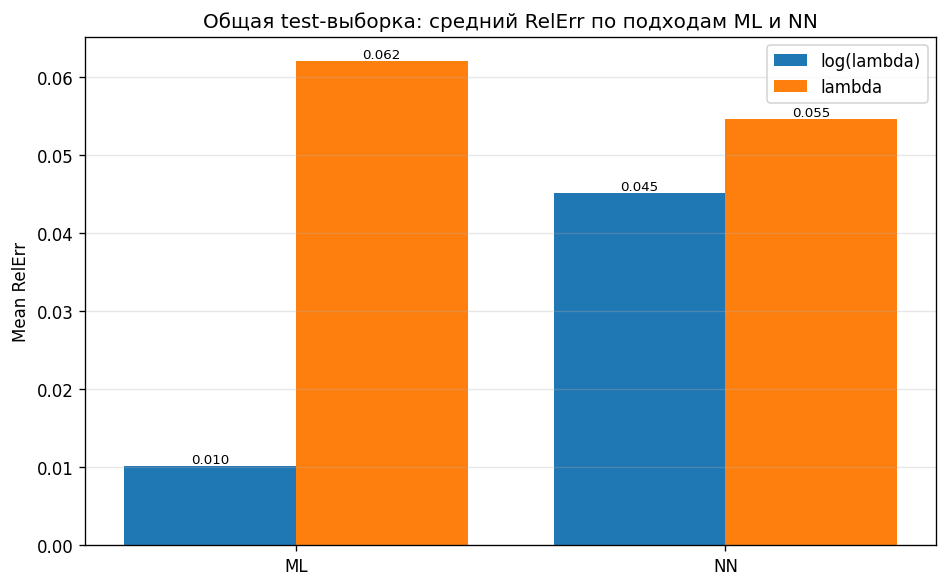
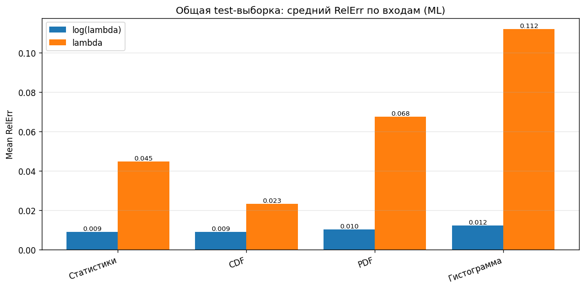
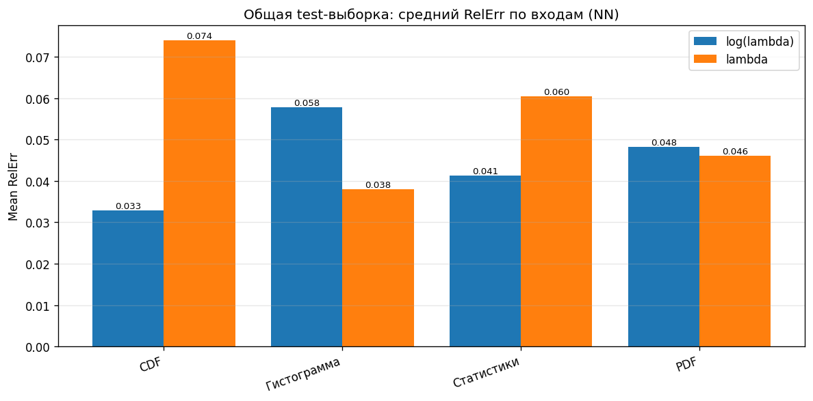
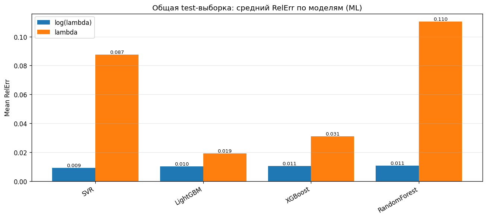
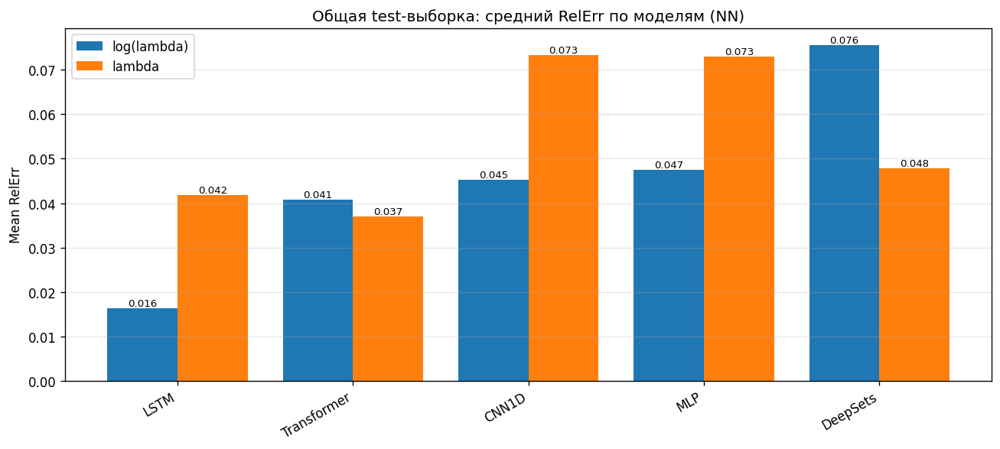
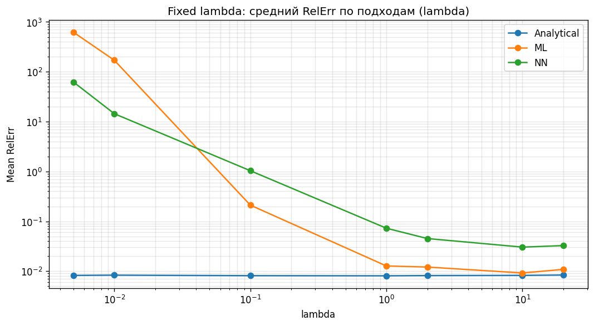
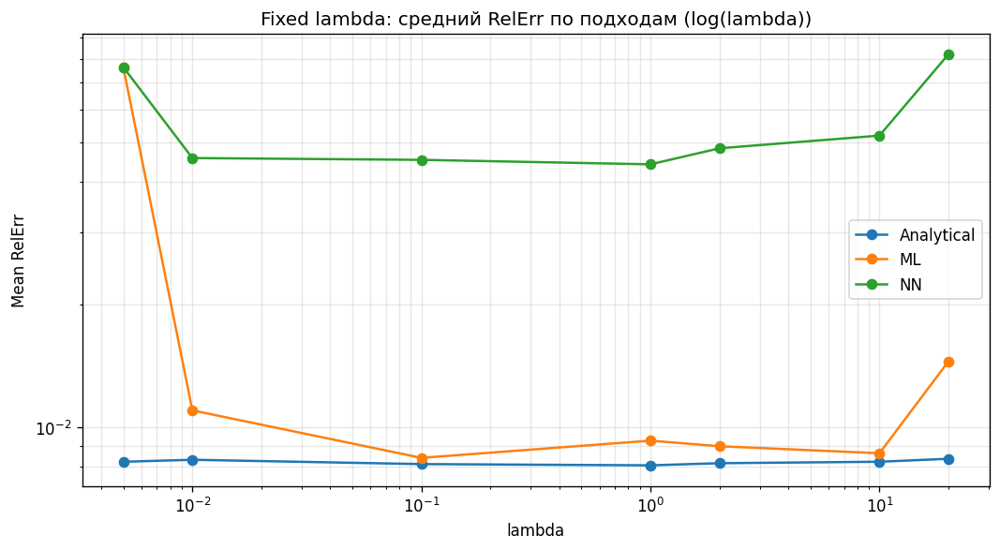
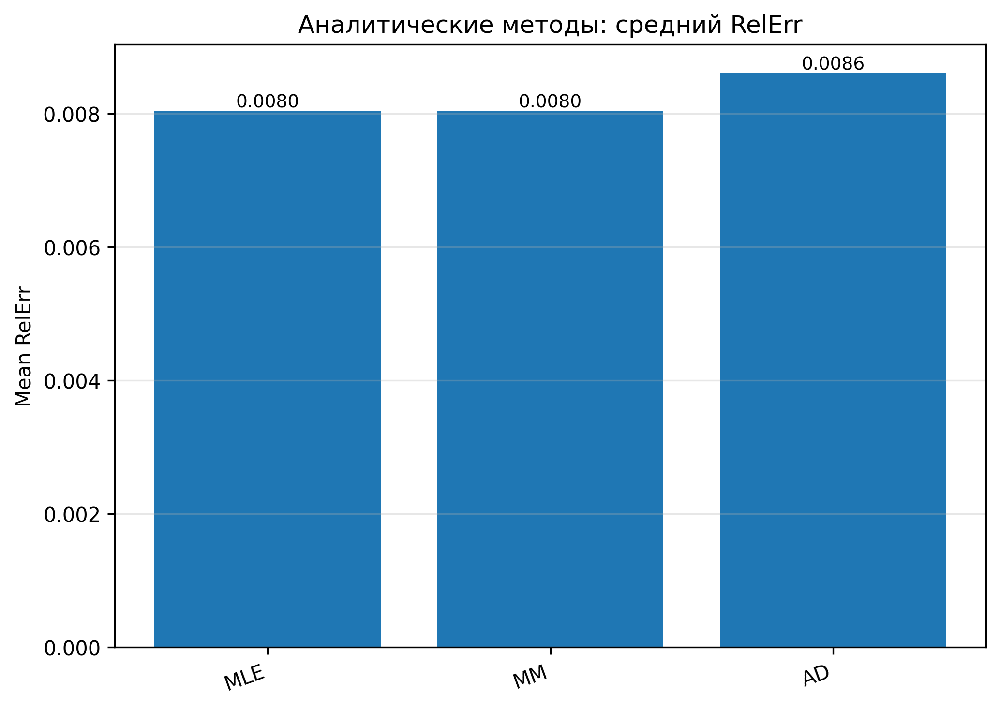
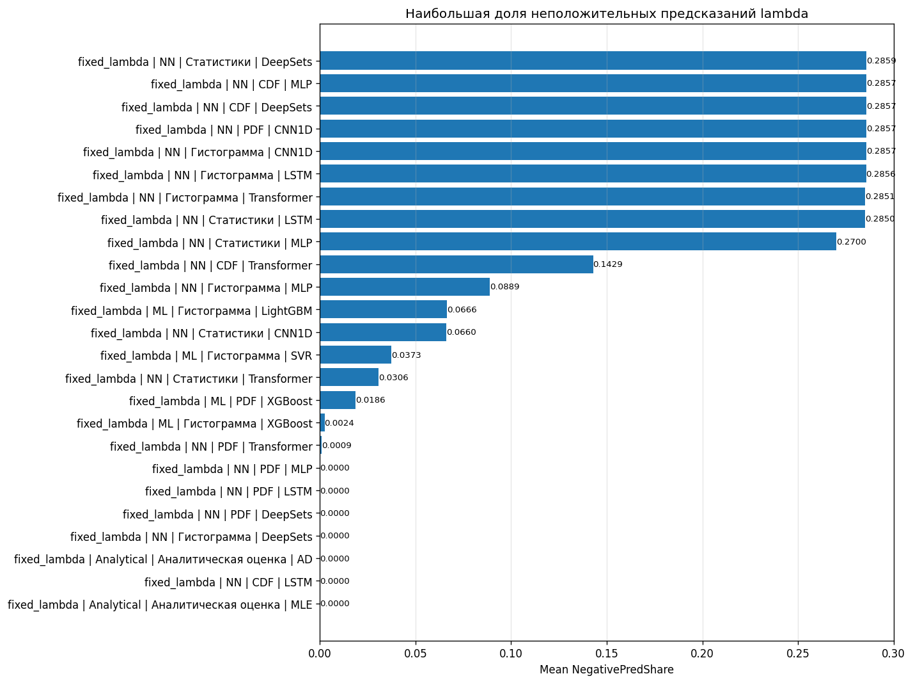

# Сравнение двух подходов к оцениванию параметра λ

**Цель сравнения:** проверить, как влияет выбор целевой переменной при обучении моделей для оценки параметра интенсивности \(\lambda\) экспоненциального распределения.

Сравнивались два варианта:

1. **Обучение на логарифме параметра:**

$$ y = \log(\lambda), \qquad \hat{\lambda}=\exp(\hat{y}).$$

2. **Прямое обучение на параметре:**

\[
y = \lambda.
\]

В обоих случаях оценивалась относительная ошибка:

\[
RelErr = \frac{|\lambda - \hat{\lambda}|}{\lambda}.
\]

Также для экспоненциального распределения использовались аналитические оценки:

\[
\hat{\lambda}_{MM} = \hat{\lambda}_{MLE} = \frac{1}{\overline{\tau}},
\]

где \(\overline{\tau}\) — средняя длина интервалов между событиями.

---

## 1. Общая test-выборка: ML и NN

На общей тестовой выборке вариант с обучением на \(\log(\lambda)\) оказался устойчивее.

| Подход | Target | Mean RelErr | Median RelErr | Min RelErr | Max RelErr |
|---|---|---:|---:|---:|---:|
| ML | log(λ) | 0.010 | 0.010 | 0.009 | 0.013 |
| ML | λ | 0.062 | 0.042 | 0.009 | 0.277 |
| NN | log(λ) | 0.045 | 0.043 | 0.013 | 0.102 |
| NN | λ | 0.055 | 0.046 | 0.016 | 0.110 |

**Вывод:** для ML-моделей логарифмирование целевой переменной даёт существенное улучшение: средняя ошибка снижается с 0.062 до 0.010. Для нейронных сетей эффект меньше, но среднее значение ошибки также лучше при обучении на \(\log(\lambda)\).

---

## 2. Сравнение по входным представлениям

Рассматривались четыре типа входных данных:

- CDF;
- PDF;
- статистики;
- гистограмма.

### ML-модели

| Target | Лучший вход | Mean RelErr |
|---|---|---:|
| log(λ) | Статистики | 0.009 |
| λ | CDF | 0.023 |

Для ML-моделей все входы при обучении на \(\log(\lambda)\) дают близкие и малые значения ошибки. При прямом обучении на \(\lambda\) ошибка заметно возрастает, особенно для PDF и гистограммы.

### NN-модели

| Target | Лучший вход | Mean RelErr |
|---|---|---:|
| log(λ) | CDF | 0.033 |
| λ | Гистограмма | 0.038 |

Для NN-моделей различие между двумя вариантами менее однозначное. На отдельных входах прямое обучение на \(\lambda\) может быть сопоставимо с логарифмическим вариантом, но в среднем \(\log(\lambda)\) остаётся устойчивее.

---

## 3. Сравнение по моделям

### ML-модели

| Target | Лучшая модель | Mean RelErr |
|---|---|---:|
| log(λ) | SVR | 0.009 |
| λ | LightGBM | 0.019 |

**Вывод по ML:** все ML-модели показали лучшие результаты при обучении на \(\log(\lambda)\). В парном сравнении по одинаковым входам и моделям вариант \(\log(\lambda)\) оказался лучше во всех 16 случаях.

### NN-модели

| Target | Лучшая модель | Mean RelErr |
|---|---|---:|
| log(λ) | LSTM | 0.016 |
| λ | Transformer | 0.037 |

**Вывод по NN:** для нейронных сетей ситуация менее жёсткая: \(\log(\lambda)\) лучше в 11 случаях, прямое обучение на \(\lambda\) — в 9 случаях. Однако лучшая NN-модель всё равно получена при обучении на \(\log(\lambda)\).

---

## 4. Проверка на фиксированных значениях λ

Отдельно модели проверялись на фиксированных значениях параметра:

\[
\lambda \in \{0.005,\ 0.01,\ 0.1,\ 1,\ 2,\ 10,\ 20\}.
\]

Такой эксперимент показывает, где именно модель ошибается: на малых, средних или больших значениях интенсивности.

### Прямое обучение на λ

При прямом обучении на \(\lambda\) наблюдается резкий рост ошибки на малых значениях параметра. Особенно это заметно для \(\lambda=0.005\) и \(\lambda=0.01\). Причина в том, что модель оптимизирует абсолютную ошибку, а качество оценивается относительной ошибкой. Даже небольшое абсолютное смещение на малой \(\lambda\) даёт большой \(RelErr\):

\[
\lambda=0.005, \quad \hat{\lambda}=0.02,
\]

\[
RelErr = \frac{|0.005-0.02|}{0.005}=3.
\]

То есть относительная ошибка составляет 300%.

### Обучение на log(λ)

При обучении на \(\log(\lambda)\) ошибка распределяется значительно равномернее по диапазону значений \(\lambda\). Это связано с тем, что логарифмирование переводит задачу в мультипликативный масштаб:

\[
\widehat{\log(\lambda)} = \log(\lambda) + \Delta,
\]

\[
\hat{\lambda}=\lambda e^{\Delta}.
\]

То есть ошибка в логарифме соответствует относительному, а не абсолютному отклонению параметра.

---

## 5. Сравнение с аналитическими методами

Для экспоненциального распределения аналитические методы дают наиболее стабильный результат.

| Метод | Mean RelErr | Median RelErr | Min RelErr | Max RelErr |
|---|---:|---:|---:|---:|
| MLE | 0.008 | 0.008 | 0.008 | 0.008 |
| MM | 0.008 | 0.008 | 0.008 | 0.008 |
| AD | 0.009 | 0.009 | 0.008 | 0.009 |

**Вывод:** для экспоненциального распределения аналитическая оценка \(1/\overline{\tau}\) остаётся теоретически обоснованным эталоном. ML и NN в этом эксперименте нужны не для замены аналитики, а для проверки общего pipeline, который дальше можно применять к более сложным распределениям и потокам.

---

## 6. Отрицательные предсказания при прямом обучении

При прямом обучении на \(\lambda\) модель теоретически может выдать неположительное значение:

\[
\hat{\lambda} \leq 0,
\]

что недопустимо для параметра экспоненциального распределения, так как:

\[
\lambda > 0.
\]

У лучших моделей на общей test-выборке эта проблема выражена слабо, но на fixed lambda для некоторых NN-моделей и входов доля неположительных предсказаний становится заметной. При обучении на \(\log(\lambda)\) такой проблемы нет, потому что итоговая оценка восстанавливается через экспоненту:

\[
\hat{\lambda}=\exp(\hat{y})>0.
\]

---

## 7. Итоговые выводы

1. **Обучение на \(\log(\lambda)\) в среднем лучше прямого обучения на \(\lambda\).** Особенно заметно это для ML-моделей.

2. **Для ML-моделей логарифмирование оказалось однозначно предпочтительным:** вариант \(\log(\lambda)\) лучше во всех 16 парных сравнениях.

3. **Для NN-моделей эффект менее однозначный**, но лучший результат среди NN также получен при обучении на \(\log(\lambda)\).

4. **Главная проблема прямого обучения на \(\lambda\)** — нестабильность на малых значениях параметра. Маленькая абсолютная ошибка превращается в большую относительную ошибку.

5. **Логарифмирование лучше согласуется с метрикой RelErr**, так как переводит задачу из абсолютного масштаба в мультипликативный.

6. **Аналитические методы MM/MLE остаются лучшими для экспоненциального распределения**, потому что для него существует простая оценка:

\[
\hat{\lambda}=\frac{1}{\overline{\tau}}.
\]

7. **Рекомендация для дальнейших экспериментов:** оставить обучение на \(\log(\lambda)\) как основной вариант, а прямое обучение на \(\lambda\) использовать как контрольный эксперимент для обоснования выбора целевого преобразования.

---

## Короткая формулировка для обсуждения с научным руководителем

Проведён контрольный эксперимент, в котором модели обучались напрямую на параметре \(\lambda\), без логарифмирования целевой переменной. Сравнение показало, что обучение на \(\log(\lambda)\) обеспечивает более устойчивое качество, особенно для ML-моделей и для малых значений \(\lambda\). При прямом обучении модель минимизирует абсолютную ошибку, тогда как оценка качества проводится по относительной ошибке; из-за этого даже небольшое абсолютное отклонение при малых \(\lambda\) приводит к резкому росту \(RelErr\). Поэтому логарифмическое преобразование целевой переменной является более предпочтительным для данной задачи.
